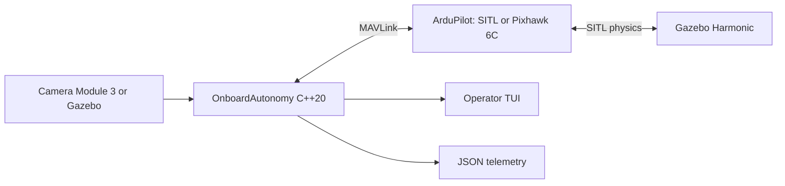

# OnboardAutonomy

[](https://github.com/matemink/OnboardAutonomy/actions/workflows/ci.yml)
[](https://isocpp.org/)
[](https://www.raspberrypi.com/)

OnboardAutonomy is a C++20 onboard autonomy runtime for ArduPilot-based
UAVs. It runs against ArduCopter SITL or a physical Pixhawk, handles
MAVLink command and telemetry flows, processes onboard camera frames,
and exposes vehicle state through an operator console and JSON snapshots.

The project is building toward vision-guided precision landing on a
Raspberry Pi 5 and Pixhawk 6C. Development remains reproducible without
real flight: motion is verified in SITL and Gazebo, while hardware work
is performed on a propeller-free bench.

## System overview



ArduPilot remains responsible for stabilization and flight control.
OnboardAutonomy owns companion-computer concerns: telemetry, health,
scenario orchestration, vision, diagnostics, and future landing-target
guidance.

## Capabilities

- MAVLink 2 decoding and encoding through pinned generated C headers.
- UDP transport for SITL and Linux serial transport for Pixhawk USB/UART.
- Freshness-aware GPS, battery, system-health, PreArm, and link state.
- Sequential telemetry-rate configuration with `COMMAND_ACK`, timeouts,
  and bounded retries.
- ArduPilot firmware and board metadata without model-name guessing.
- Five guarded SITL scenarios with command acknowledgements and telemetry
  confirmation: hover, out-and-RTL, square, search, and precision landing.
- Raspberry Pi Camera Module 3 YUV420 ingestion, performance metrics,
  AprilTag detection, and a read-only browser preview.
- Native Linux tests, Python integration tests, fault injection, and an
  ARM64 cross-build quality gate in GitHub Actions.

## Verified environments

| Environment | Evidence |
| --- | --- |
| Ubuntu 24.04 / WSL2 | Native C++ build, unit tests, ArduCopter SITL, and fault injection |
| Gazebo Harmonic | Automated takeoff, route scenarios, RTL, landing, and H.264 camera stream |
| Raspberry Pi 5 | ARM64 runtime, Camera Module 3 Wide, and concurrent camera/MAVLink processing |
| Pixhawk 6C | Real USB MAVLink telemetry, health state, metadata, and acknowledged stream requests |

The measured Raspberry Pi camera path sustained `30.013 FPS` with zero
processing drops and approximately `10 ms` sensor-to-application latency
on the documented bench setup.

## Quick start

Ubuntu 24.04 or Raspberry Pi OS 64-bit is recommended.

```bash
sudo bash scripts/bootstrap_ubuntu.sh
cmake -S . -B build -G Ninja -DCMAKE_BUILD_TYPE=Debug
cmake --build build --parallel
ctest --test-dir build --output-on-failure
python3 -m unittest discover -s python/tests -v
```

Run the service with generated healthy MAVLink telemetry:

```bash
./build/onboard_autonomy --udp-port 14550
```

In a second terminal:

```bash
python3 -m venv .venv
source .venv/bin/activate
python -m pip install -r python/requirements.txt
python python/scenario_runner.py --scenario healthy
```

Continue with the [development and SITL](docs/development.md),
[Gazebo simulation](docs/simulation.md), or
[Raspberry Pi/Pixhawk bench](docs/raspberry-pi-5-bench.md) runbook.

## Architecture

The code follows dependency inversion without introducing a framework:

```text
domain <- application <- adapters / presentation
```

Application-owned ports isolate MAVLink transport, camera capture,
target detection, and camera preview. CMake targets enforce the main
build-time boundaries, while test fakes exercise application behavior
without SITL, camera hardware, or a serial device.

| Path | Responsibility |
| --- | --- |
| `include/onboard_autonomy/domain/` | Vehicle concepts and readiness rules |
| `include/onboard_autonomy/application/` | Use cases and I/O ports |
| `src/adapters/` | MAVLink, transport, camera, preview, and AprilTag adapters |
| `src/presentation/` | Operator console |
| `tests/` | Dependency-light C++ tests |
| `python/` | Integration harnesses, fault injection, and camera tooling |
| `scripts/` | Reproducible development, simulation, and deployment commands |
| `docs/` | Architecture, runbooks, roadmap, and learning notes |

See [docs/architecture.md](docs/architecture.md) for the complete runtime
and build-time dependency diagrams.

## Project status

The telemetry, command, simulation, ARM deployment, camera ingestion,
and pixel-space AprilTag stages are implemented. The current precision
scenario proves a synthetic MAVLink `LANDING_TARGET` integration seam.
It does not present synthetic observations as real camera guidance.

The next vertical slice is camera calibration, AprilTag 3D pose
estimation, coordinate-frame validation, and replacement of the
synthetic target provider. Progress and acceptance criteria live in
[docs/roadmap.md](docs/roadmap.md).

## Safety

Normal startup is observation-only. Automated motion requires an
explicit SITL-only flag or interactive trigger. The executable rejects
motion scenarios when a serial transport is selected. Physical bench
work is performed with propellers removed, and autonomous behavior is
validated in simulation before hardware-in-the-loop testing.

## Documentation

- [Architecture](docs/architecture.md)
- [Development and SITL runbook](docs/development.md)
- [Gazebo simulation runbook](docs/simulation.md)
- [Raspberry Pi 5 and Pixhawk 6C bench](docs/raspberry-pi-5-bench.md)
- [Roadmap](docs/roadmap.md)
- [Ukrainian learning track](docs/learning/README.uk.md)
