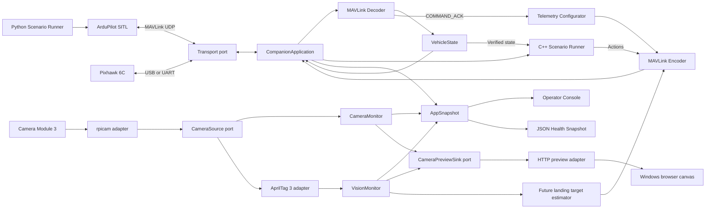
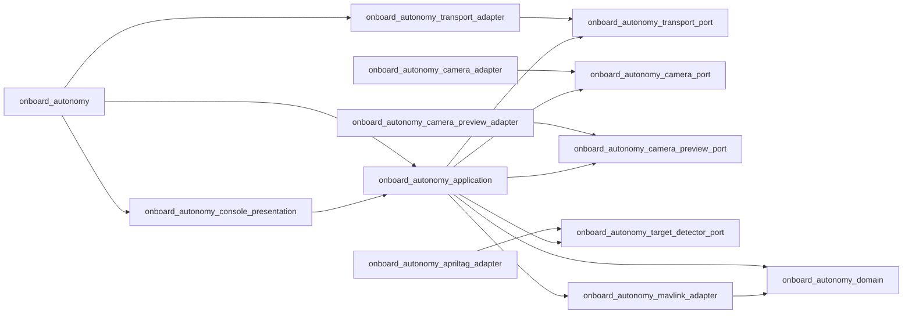

# Architecture

OnboardAutonomy keeps flight-controller I/O, protocol decoding, state, vision,
and test orchestration separate.

## Build-time boundaries

## Design boundaries

### Transport

The application-owned `Transport` port moves bytes only. UDP and Linux
serial adapters implement that contract without understanding MAVLink
or vehicle readiness. UDP is used for SITL; Linux serial is used for
the Pixhawk bench connection. Serial reads use `VMIN=0` and `VTIME=0`
because timing belongs to the application loop; a transport read must
not stall camera or scenario polling.

### Camera source and monitor

The application-owned `CameraSource` port returns typed YUV420 frames
without exposing Linux processes or `rpicam` arguments. The Linux
`RpicamCameraSource` adapter starts `rpicam-vid` with a fixed manual
hyperfocal lens position, receives fixed-size raw
frames through one pipe, and receives per-frame metadata through another.

`FrameWallClock` is paired with each completed frame. `CameraMonitor`
calculates consumed FPS, sequence gaps, latest/average/maximum
sensor-to-application latency, and frame age. It does not know whether
the source is `rpicam`, a future GStreamer source, or a test fake.

### Vision and camera preview

The application-owned `TargetDetector` port maps a `CameraFrame` into
typed `TargetObservation` values. The current adapter uses the official
AprilTag 3 implementation with the `tagStandard41h12` family and reads
the Y plane directly, without OpenCV or a color conversion.

The separate application-owned `CameraPreviewSink` receives the same
frame plus its current detections. Its HTTP adapter rate-limits copies
to 10 FPS and serves raw luminance bytes to a browser canvas. The browser
draws target corners, center, ID, and decision margin. Neither the
application nor the camera adapter depends on HTTP or HTML.

### MAVLink decoder

The decoder owns parser state so fragmented messages can span multiple
reads. It uses generated `c_library_v2` headers and maps only supported
messages into domain observations. Heartbeats from non-autopilot
components are ignored when selecting the vehicle identity.

### MAVLink encoder

The encoder uses the same generated MAVLink headers to create outbound
frames. OnboardAutonomy discovers the autopilot system ID, uses component ID
`191`, and broadcasts an onboard-controller heartbeat at 1 Hz.

### Vehicle state

The state model owns freshness windows and readiness rules. Missing data
is unknown rather than healthy. A heartbeat older than three seconds
invalidates the entire connected snapshot.

### Application

`CompanionApplication` owns the long-running use-case orchestration:
reading transport bytes, feeding the decoder, scheduling the companion
heartbeat, advancing telemetry setup, and writing outbound frames. Its
public header uses Pimpl so MAVLink implementation types do not leak
into callers.

`AppSnapshot` combines domain state with application-level heartbeat
and telemetry-setup status. Presentation depends on this neutral model,
not on `MavlinkDecoder` or `TelemetryStreamConfigurator`.

### Telemetry configurator

After discovering the vehicle system ID, the configurator requests
health, GPS, battery, global position, local NED position, and attitude
streams. Requests are sent sequentially because `COMMAND_ACK` identifies
the command but does not echo the requested message ID. Each request has
a two-second timeout and at most three attempts. Disconnecting resets the
state machine.

### Scenario runner

The C++ `ScenarioRunner` executes typed scenario definitions. Command steps
wait for `COMMAND_ACK` and telemetry confirmation. Route steps send
`SET_POSITION_TARGET_LOCAL_NED` and compare the observed
`LOCAL_POSITION_NED` against the target. RTL and landing complete only
after the vehicle reports `DISARMED`.

Five scenarios are available from the interactive terminal. The precision
scenario sends a synthetic body-FRD `LANDING_TARGET` in SITL; it is an
integration seam for the current camera/AprilTag observations. Pixel
observations are not yet converted into pose or wired to MAVLink, so the
scenario remains synthetic.

Python remains test orchestration: it starts SITL, injects failures, and
asserts behavior from JSON output.

### Guidance

Vision currently ends at pixel-space target observations. Pose
estimation and `LANDING_TARGET` guidance remain intentionally absent
until camera intrinsics and physical tag size are calibrated. ArduPilot
remains responsible for the flight-control loop.
